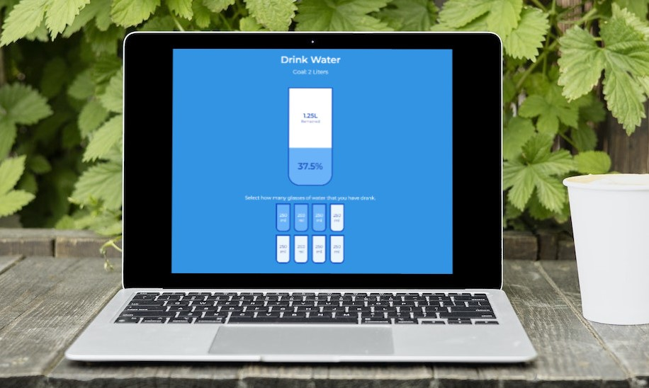

# Incrementing Counter

This is the Drink Water project (Day 16) in the [Udemy course 50 projects in 50 Days](https://www.udemy.com/course/50-projects-50-days/?src=sac&kw=50+projects+50+days).

## Project Details

The goal of the project is to create a visually appealing tracker for how much water you drink during in the day. 

### View My Project:

## Features

- View the current amount of water consumed as a percentage and the remaining amount required to meet the daily recommendation.
- Select individual glasses to reflect the current amount of water consumed.
- Individual glasses can be toggled to display full or empty.

## Technologies Used

- HTML5
- CSS3
- JavaScript

## My Process

- Start the files from a boiler template.
- Create the large cup and several smaller cups.
- Add styles.
- Create variables for the target elements.
- Add an event listener to the small cups to listen for a click.
- In that event listener, run a function that highlights the small cup and pass in the index of the cup clicked.
- Create the function to highlight the small cups:
    * Pass in the index for the cup clicked.
    * Create an if statement to toggle the last cup clicked by checking if the next cup is full or empty. If the next cup is full, empty the next cup; if the next cup is empty, empty the cup clicked.
    * For each of the small cups, check the index of the cup clicked and if there are empty cups before the clicked cup, fill those cups as well as the clicked cup.
- Create a function to update the large cup according to how many of the smaller cups are full:
    * Create a variable for the number of full cups.
    * Create a variable for the number of small cups.
    * Add an if statement to display the percentage of water consumed if the number of full small cups is greater than zero. This percentage is shown as text and as a highlighted portion of the large cup.
    * Add another if statement to address the remaining value for water required to meet the daily recommendation:
        * If the required recommendation has been met, hide the remaining value.
        * If the required recommendation has not been met, show the remaining value of liters that is still to be consumed.
- Run that function to update the large cup when the browser loads and inside the function to highlight the small cups, at the very end.

### Continued development

I enjoyed using this approach that allows the user to visually track the amount of daily water consumption without the need for guessing. I learnt how to utilize a second index for highlighting the small cups, and I am entertaining the idea of updating this project to include half glasses of water.

## Acknowledgements

Original Project idea: Brad Traversy, Florin Pop [Udemy course 50 Projects in 50 Days](https://www.udemy.com/course/50-projects-50-days/?src=sac&kw=50+projects+50+days)

Original HTML, CSS & Javascript provided by: Brad Traversy, Florin Pop [Udemy course 50 Projects in 50 Days](https://www.udemy.com/course/50-projects-50-days/?src=sac&kw=50+projects+50+days)